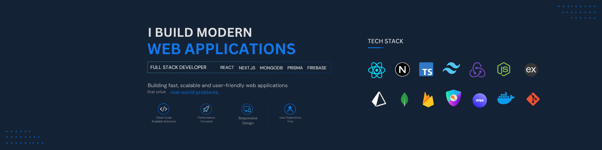

<h1 align="center">Hi 👋, I'm Al Amin</h1>

<h3 align="center">
Full Stack Developer from Bangladesh 🇧🇩
</h3>

Building Fast, Secure & Scalable Web Applications

  

  

  

  

  

---

# 🚀 About Me

- 💻 Full Stack Web Developer
- ⚛️ Specialized in Next.js & React
- 🌱 Currently learning scalable backend architecture
- 🚀 Passionate about building production-ready applications
- ⚡ Love writing clean and maintainable code

---

# 🛠 Tech Stack

---

# 📌 Featured Projects

## 🛒 Next Commerce

> A production-ready full stack e-commerce application.

**Tech Stack**

- Next.js
- TypeScript
- MongoDB
- Prisma
- NextAuth
- Stripe
- Cloudinary
- Tailwind CSS

---

## 💼 Developer Portfolio

A modern portfolio built with Next.js featuring animations, responsive UI and optimized performance.

---

## 🔐 Authentication System

Authentication system with Google Login, Credentials Login, Role Based Access Control and Protected Routes.

---

# 📈 GitHub Analytics

---

# 🔥 Current Focus

- 🚀 Next.js App Router
- ⚛️ React
- 🟦 TypeScript
- 🗄 MongoDB
- 🔥 Prisma ORM
- 💳 Stripe Integration
- 🔐 Authentication
- ⚡ Performance Optimization

---

# 📬 Contact Me

- 🌐 Portfolio: [https://alaminhosen.vercel.app/](https://alaminhosen.vercel.app/)

- 💼 LinkedIn: [https://linkedin.com/in/alamin-one/](https://www.linkedin.com/in/alamin-one/)

- 📧 Email: alamin1developer@gmail.com

---

# 🧰 Tools

---

# 📊 Activity Graph

---

# 👀 Profile Views

---

### 💙 Thanks for visiting my profile!

*"Code. Learn. Build. Repeat."*

⭐ Don't forget to check out my repositories.

